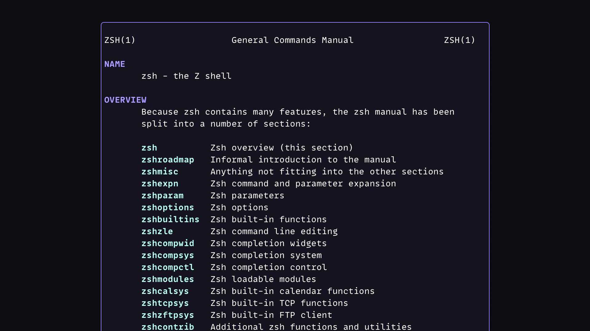

# Dracula for [man-pages](https://man7.org/linux/man-pages/man1/man.1.html)

> A dark theme for [man-pages](https://man7.org/linux/man-pages/man1/man.1.html).

## Install

All instructions can be found at [draculatheme.com/man-pages](https://draculatheme.com/man-pages).

## Team

This theme is maintained by the following person(s) and a bunch of [awesome contributors](https://github.com/dracula/foobar/graphs/contributors).

|  |
| ------------------------------------------------------------------------------------------ |
| [urrickhunt](https://github.com/urrickhunt)                                                |

## Community

- [Twitter](https://twitter.com/draculatheme) - Best for getting updates about themes and new stuff.
- [GitHub](https://github.com/dracula/dracula-theme/discussions) - Best for asking questions and discussing issues.
- [Discord](https://draculatheme.com/discord-invite) - Best for hanging out with the community.

## License

[MIT License](./LICENSE)
